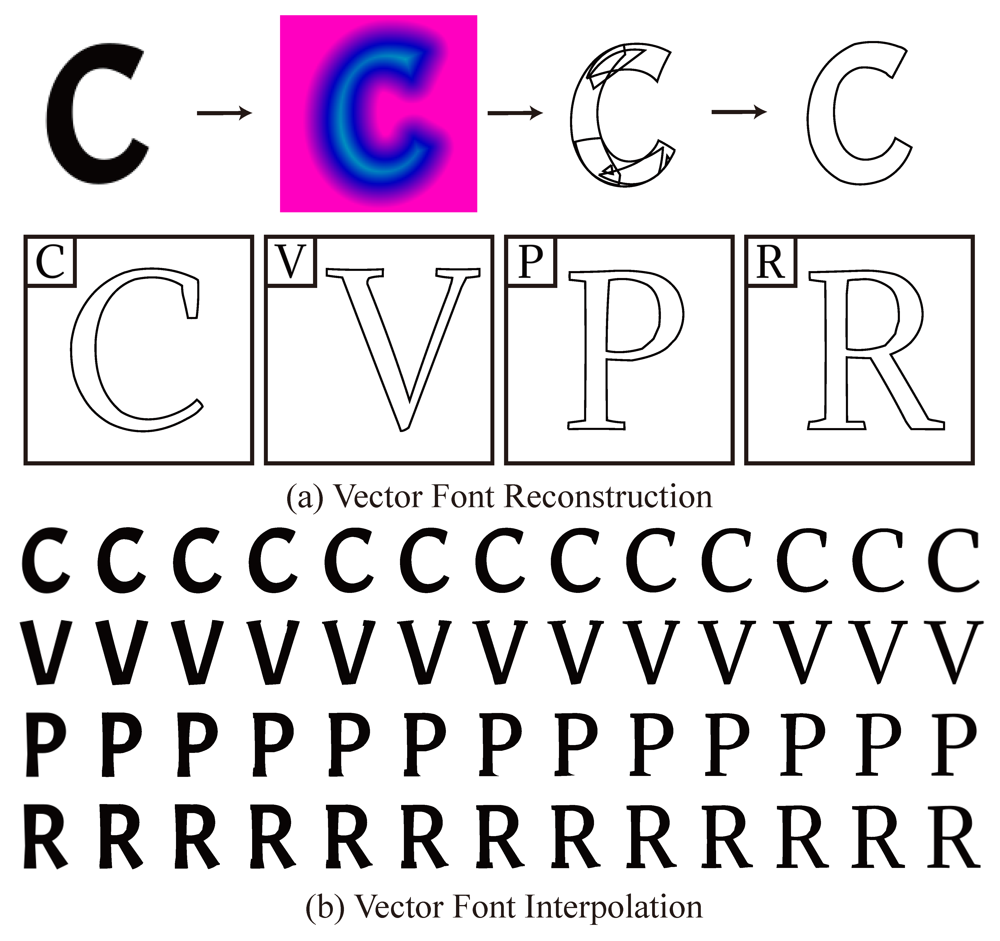

<div align="center">

# VecFontSDF: Learning to Reconstruct and Synthesize High-quality Vector Fonts via Signed Distance Functions

**CVPR 2023**

[Zeqing Xia](https://xiazeqing.github.io/)<sup>\*</sup> &nbsp;·&nbsp;
[Bojun Xiong](https://ymxbj.github.io/)<sup>\*</sup> &nbsp;·&nbsp;
[Zhouhui Lian](https://www.icst.pku.edu.cn/zlian/)<sup>†</sup>

Wangxuan Institute of Computer Technology, Peking University

<sub><sup>\*</sup> Equal contribution &nbsp;&nbsp; <sup>†</sup> Corresponding author</sub>

[Project page](https://xiazeqing.github.io/VecFontSDF/) ·
[arXiv](https://arxiv.org/abs/2303.12675)

<br>



</div>

---

The official PyTorch implementation of the VecFontSDF paper. This paper proposes an end-to-end trainable method, VecFontSDF, to reconstruct and synthesize high-quality vector fonts using signed distance functions (SDFs). Specifically, based on the proposed SDF-based implicit shape representation, VecFontSDF learns to model each glyph as shape primitives enclosed by several parabolic curves, which can be precisely converted to quadratic Bézier curves that are widely used in vector font products. In this manner, most image generation methods can be easily extended to synthesize vector fonts. Qualitative and quantitative experiments conducted on a publicly available dataset demonstrate that our method obtains high-quality results on several tasks, including vector font reconstruction, interpolation, and few-shot vector font synthesis, markedly outperforming the state of the art.

## Table of contents

- [Installation](#installation)
- [Repository structure](#repository-structure)
- [Inference](#inference)
- [Data preparation](#data-preparation)
- [Training](#training)
- [Release plan](#release-plan)
- [Citation](#citation)
- [License](#license)
- [Contact](#contact)
- [Acknowledgments](#acknowledgments)

## Installation

The code has been tested on Python 3.12, CUDA 12.8, PyTorch 2.7 with NVIDIA V100 GPUs.

```bash
git clone https://github.com/ymxbj/VecFontSDF.git
cd VecFontSDF

conda create -n vecfontsdf python=3.12 -y
conda activate vecfontsdf

# Install PyTorch matching your CUDA version, e.g.:
pip3 install torch==2.7.0 torchvision==0.22.0 --index-url https://download.pytorch.org/whl/cu128

pip3 install -r requirements.txt
```

## Repository structure

```
VecFontSDF/
├── options.py     — command-line arguments
├── dataloader.py  — single-glyph dataset
├── model.py       — class-conditional ResNet encoder + curve-parameter head
├── losses.py      — pseudo distance field + differentiable rasterization + losses
├── train.py       — iteration-based training loop
├── inference.py   — load a checkpoint and reconstruct an image / directory
├── data_prep/     — turn raw SVG fonts into the training-ready layout
│   ├── geometry.py            — Pos, StraightLine, QuadraticBezier primitives
│   ├── glyph.py               — Glyph / Contour: SVG parsing + signed distance
│   ├── cubic_to_quadratic.py  — rewrite cubic-Bezier SVGs as quadratic-only
│   ├── svg_to_grid_sdf.py     — per-pixel grid SDF generator
│   ├── svg_to_contour_sdf.py  — contour-aligned SDF sample generator
│   └── svg_to_png.py          — SVG → raster PNG (uses cairosvg)
├── sdf2svg/       — convert predicted parabolic curves to a vector SVG glyph
│   ├── pos.py                 — 2D point primitive
│   ├── lines.py               — straight-line / quadratic-Bezier curve classes
│   ├── bspt.py                — parabolic-primitive mesh intersection / union
│   └── outliner.py            — stitch boundary curves into clean filled contours
└── README.md
```

## Inference

Download the pre-trained checkpoint from
[Google Drive](https://drive.google.com/file/d/1ozaQzSr9TC-dpOhmcOH2EzHjHYdfonrV/view?usp=sharing)
and place it under `experiments/vecfontsdf/checkpoints/`:

```bash
mkdir -p experiments/vecfontsdf/checkpoints
gdown 1ozaQzSr9TC-dpOhmcOH2EzHjHYdfonrV \
    -O experiments/vecfontsdf/checkpoints/VecFontSDF.pth
```

The resulting layout is:

```
experiments/vecfontsdf/
└── checkpoints/
    └── VecFontSDF.pth
```

The model hyperparameters default to this checkpoint's configuration
(`char_categories=52`, `fc_channel=256`, `v_dim=16`, `p_dim=6`,
`image_size=128`, `gamma=0.02`), so no `opts.txt` is required. If you point
`--ckpt` at one of your own training runs, `inference.py` reads the architecture
from the sibling `experiments/<name>/opts.txt` automatically.

Because the model is class-conditional, every input glyph needs a character
label. Pass it with `--char` for a single file, or name the files after the
glyph (`A.png`, `g.png`, or the ASCII codepoint `65.png`) for a directory.

```bash
python3 inference.py \
    --ckpt experiments/vecfontsdf/checkpoints/VecFontSDF.pth \
    --input some_glyph.png --char A \
    --render_size 256 \
    --save_params --save_svg
```

Produces, in `experiments/vecfontsdf/inference/`:

- `<stem>_recon.png` — input next to the reconstruction at `--render_size`.
- `<stem>_params.npy` (with `--save_params`) — `[N_p * N_a, 6]` array of
  parabolic curve parameters; the 6 columns are `(k, p, q, d, e, f)`.
- `<stem>.svg` (with `--save_svg`) — the predicted curves stitched into a
  vector glyph of connected quadratic-Bezier contours.

`--input` may also be a directory, in which case all `.png` / `.jpg` files
in it are processed in a single pass (the character is inferred from each
file name).

### Vector SVG output

`--save_svg` runs the `sdf2svg` package, which intersects/unions the predicted
parabolic primitives and stitches the boundary into clean filled contours (the
output carries a `matrix(0 1 1 0 0 0)` transform that maps the model's
`(x=row, y=col)` parameter space back to upright screen coordinates). You can
also call it directly:

```python
import numpy as np
from sdf2svg import params_to_svg
params = np.load('experiments/vecfontsdf/inference/A_params.npy')  # [v*p, 6]
params_to_svg(params, v_dim=16, p_dim=6, out_path='A.svg', merge=0.02)
```

The contour-stitching solver has rare data-dependent failures on degenerate
primitive configurations; `--save_svg` skips the affected glyph (with a warning)
and continues.

#### `--svg_merge` (endpoint-merge threshold)

When the boundary curve segments are stitched into closed contours, two
endpoints are treated as the same vertex — and welded together — when they lie
within `--svg_merge` of each other. Concretely it controls three things in
`cleanmesh_connect`: merging nearby endpoints into one vertex, dropping
zero-length segments, and chaining a curve's end onto the next curve's start.

- **Only matters with `--save_svg`.** Without it the SVG branch never runs, so
  the value is ignored. The default `0.02` is fine for most glyphs; reach for
  this knob only when a specific glyph comes out broken.
- **Units:** the SVG `viewBox` spans 2 units across the glyph, so `0.02` is
  about 1% of the glyph width.
- **Tuning:** too small leaves contours that should connect open (broken fill);
  too large welds distinct nearby features together (wrong topology, e.g. a
  counter/hole disappearing).

```bash
# default merge (0.02)
python3 inference.py --ckpt <ckpt> --input g.png --char g --save_svg

# nudge the threshold when a glyph stitches poorly
python3 inference.py --ckpt <ckpt> --input g.png --char g --save_svg --svg_merge 0.03
```

## Data preparation

The training set is organized one directory per font, named with a 4-digit
zero-padded integer id (e.g. `0123`):

```
data/
├── font_list.txt                a python-eval-able list of ints, e.g. [0, 1, 2, ...]
├── img/
│   ├── 0000/                    font #0
│   │   ├── 0.png                glyph index 0 (= 'A')
│   │   ├── 1.png                glyph index 1 (= 'B')
│   │   └── ...                  52 files total: A-Z + a-z
│   └── 0001/
└── sdf/
    └── 0000/
        └── sdf/
            ├── 65_grid.npy      [H, W] grid SDF for 'A' (ASCII 65)
            ├── 65_contour.npy   [M_c, 3] = (x, y, sdf) contour samples for 'A'
            └── ...
```

The model is **class-conditional** over the 52 letters `A-Z` then `a-z`; the
glyph index `0..51` is exactly the conditioning class label (0 = 'A', 25 = 'Z',
26 = 'a', 51 = 'z'). Digits are not modeled.

Notes on the on-disk naming:
- Image files are named by **glyph index 0..51** (`0.png`, `1.png`, ...).
- SDF files are named by **ASCII codepoint** (`65_grid.npy` is `'A'`,
  `97_grid.npy` is `'a'`, ...).
- `grid.npy` is stored as `(col, row)` and is transposed by the dataloader
  to standard `(row, col)`. Positive values are outside the glyph, negative
  inside.
- `contour.npy` is a `(M_c, 3)` array; each row is
  `(x, y, signed_distance)` in pixel units (`x` is the column coordinate
  and `y` is the row coordinate, both in `[0, H]`).

### Generating SDFs from raw SVG fonts

If you start from a directory of SVG glyphs (one directory per font,
filenames `<codepoint>.svg`), the helpers under `data_prep/` produce
everything the dataloader expects. Each script auto-skips files that
already exist, so they are safe to rerun.

The SDF / dataloader pipeline only understands SVG path commands `M`, `L`,
and `Q` (move, line, and quadratic Bezier). If your input SVGs contain
cubic Bezier `C` segments, run the downgrade step first.

```bash
# 0. (optional) downgrade cubic-Bezier SVGs to quadratic-only
python3 data_prep/cubic_to_quadratic.py \
    --svg_root /path/to/cubic_svg --out_root /path/to/quadratic_svg --workers 8

# 1. rasterized glyph images (uses cairosvg)
python3 data_prep/svg_to_png.py \
    --svg_root /path/to/quadratic_svg --out_root ./data/img --image_size 128 --workers 8

# 2. per-pixel grid SDF
python3 data_prep/svg_to_grid_sdf.py \
    --svg_root /path/to/quadratic_svg --out_root ./data/sdf --image_size 128 --workers 8

# 3. contour-aligned SDF samples (default 4000 points per glyph)
python3 data_prep/svg_to_contour_sdf.py \
    --svg_root /path/to/quadratic_svg --out_root ./data/sdf --num_points 4000 --workers 8

# 4. write the font id list
ls /path/to/quadratic_svg | python3 -c "import sys; print([int(x) for x in sys.stdin.read().split()])" > ./data/font_list.txt
```

Step 0 is a best-effort downgrade — a cubic that genuinely cannot be
represented as a single quadratic (its left and right tangents do not
meet at the same point) will be reported as a failure; the script writes
no output for the offending glyph and lists it at the end.

## Training

```bash
python3 train.py \
    --img_path  /path/to/img \
    --sdf_path  /path/to/sdf \
    --font_list /path/to/font_list.txt \
    --train_split 1000 \
    --batch_size 64 --num_workers 8 \
    --n_iters 100000 \
    --experiment_name vecfontsdf
```

Outputs land in `experiments/vecfontsdf/`:

- `samples/` — periodic side-by-side comparisons of GT vs. reconstruction.
- `checkpoints/` — `vecfontsdf_*.pth` snapshots and a rolling `latest.pth`.
- `logs/` — TensorBoard event files (if `tensorboard` is installed).
- `opts.txt` — full dump of the run's hyperparameters; used by
  `inference.py` to restore the model architecture.

Run `python3 train.py --help` for the full argument list (loss
weights, primitive count, optimizer hyperparameters, validation cadence,
etc.).

To resume from a checkpoint, rerun the same training command with
`--resume <path-to-ckpt>` appended:

```bash
python3 train.py \
    --img_path  /path/to/img \
    --sdf_path  /path/to/sdf \
    --font_list /path/to/font_list.txt \
    --train_split 1000 \
    --batch_size 64 --num_workers 8 \
    --n_iters 100000 \
    --experiment_name vecfontsdf \
    --resume experiments/vecfontsdf/checkpoints/latest.pth
```

## Release plan

- [x] Training code
- [x] Inference code
- [x] SVG ↔ SDF conversion code (SVG → grid / contour SDF + raster PNG; predicted parabolic curves → quadratic Bézier SVG)
- [x] Pre-trained checkpoints ([Google Drive](https://drive.google.com/file/d/1ozaQzSr9TC-dpOhmcOH2EzHjHYdfonrV/view?usp=sharing))
- [ ] Training data

## Citation

If you find this work useful in your research, please consider citing our paper:

```bibtex
@InProceedings{Xia_2023_CVPR,
  author    = {Xia, Zeqing and Xiong, Bojun and Lian, Zhouhui},
  title     = {VecFontSDF: Learning To Reconstruct and Synthesize High-Quality Vector Fonts via Signed Distance Functions},
  booktitle = {Proceedings of the IEEE/CVF Conference on Computer Vision and Pattern Recognition (CVPR)},
  month     = {June},
  year      = {2023},
  pages     = {1848-1857}
}
```

## License

This project is released under the [MIT License](./LICENSE).

## Contact

If you have any questions, please contact xiongbojun@pku.edu.cn.

## Acknowledgments

This work was supported by National Language Committee of China (Grant
No.: ZDI135-130), Center For Chinese Font Design and Research, and Key
Laboratory of Science, Technology and Standard in Press Industry (Key
Laboratory of Intelligent Press Media Technology).
